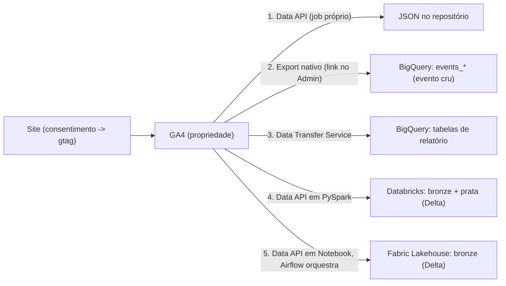

# GA4: as 5 formas de extrair os dados

O Google Analytics 4 tem um ponto de coleta (a propriedade) e mais de uma saída
para o dado. Este case mostra cinco jeitos de tirar dado de lá, como cada um é
montado, o que entrega e quanto custa.

Os três primeiros são **saídas diferentes** do GA4 — não competem, um projeto
real liga os três ao mesmo tempo porque servem consumidores diferentes: um
número solto para um dashboard leve, o evento cru para modelar do zero, a tabela
de relatório pronta para reproduzir rápido o que o GA4 já mostra.

Os caminhos 4 e 5 são o **caminho 1 (Data API) levado a sério como engenharia de
dados**, em duas stacks: Azure Databricks e Microsoft Fabric + Airflow. Aqui
entram camada bronze/prata, Delta Lake, catálogo e orquestrador.

Glossário das ferramentas e conceitos (REST, cluster, medallion, Delta Lake,
Unity Catalog, service principal, etc.): [`CONCEITOS.md`](CONCEITOS.md).

## Visão geral

### Caminhos 1–3: as saídas do GA4

| | 1 · Data API | 2 · Export nativo | 3 · Data Transfer Service |
|---|---|---|---|
| Onde se configura | código, no repositório | Admin do GA4 -> Vinculações do BigQuery | BigQuery -> Transferências -> conector "Google Analytics 4" |
| O que sai | os números que você pedir, em JSON | evento cru, um registro por evento | tabelas de relatório já agregadas |
| Autenticação | service account (chave em secret) | conta Google com acesso à propriedade | conta Google (OAuth, 1 vez) |
| Frequência | você decide (cron) | streaming + tabela diária | a cada 24h, com janela de reprocessamento |
| Custo | nenhum, dentro da cota da API | só armazenamento no BigQuery | só armazenamento no BigQuery |
| Precisa de BigQuery | não | sim | sim |
| Pasta | `caminho-1-data-api/` (código) | `caminho-2-export-nativo/` (config + SQL) | `caminho-3-dts/` (config + SQL) |

### Caminhos 4–5: a Data API como pipeline

| | 4 · Azure Databricks | 5 · Fabric + Airflow |
|---|---|---|
| Extração | GA4 Data API em PySpark | GA4 Data API num Notebook Fabric |
| Orquestrador | scheduler do Databricks (ou manual) | Apache Airflow local (Docker), dispara pela API REST do Fabric |
| Identidade | service account (secret scope) | + service principal do Entra ID pro Airflow |
| Camadas | bronze (9 chamadas) **+ prata** (tabela tratada) | bronze (9 chamadas) |
| Formato / catálogo | Delta Lake, Unity Catalog | Delta Lake, Lakehouse / OneLake |
| Segredo | Databricks secret scope | Azure Key Vault |
| Código neste repo | `caminho-4-databricks/` | `caminho-5-fabric-airflow/` |

---

## Caminho 1 — GA4 Data API

A API oficial de leitura do GA4 (`analyticsdata.googleapis.com`). Você faz um
`runReport` pedindo métricas e dimensões e recebe JSON. Um job agendado roda de
tempos em tempos, salva o JSON, e a página (ou o Slack, ou o que for) lê esse
arquivo. Sem banco de dados no meio.

### Como montar

1. No Google Cloud, criar uma **service account** e ativar a **Google Analytics
   Data API** no projeto.
2. No Admin do GA4, em **Administração -> Acesso à propriedade**, adicionar o
   e-mail da service account como **Leitor**.
3. Gerar uma **chave JSON** da service account. Guardar como secret
   (`GA_SA_KEY`). Nunca commitar.
4. Rodar o script passando a chave por variável de ambiente. Ele assina um JWT
   com a chave, troca por um access token e chama o `runReport`.
5. Agendar (aqui, um workflow do GitHub Actions a cada 3h).

### O que sai

Exatamente as métricas e dimensões do seu `runReport`. No exemplo deste repo:
totais dos últimos 28 dias (usuários, sessões, visualizações, engajamento
médio), série diária de visualizações e usuários, top páginas e top países.
Formato em [`caminho-1-data-api/analytics.sample.json`](caminho-1-data-api/analytics.sample.json).

### Detalhe: janela de reprocessamento

A série diária é histórico acumulado no próprio JSON. A cada execução o script
busca só os últimos 7 dias e sobrescreve esses dias no arquivo, preservando o
resto. O GA4 ainda corrige o dado recente por alguns dias; refazer uma janela
curta pega essa correção sem reprocessar tudo. Os totais e rankings são uma
janela móvel de 28 dias, sempre refeitos por inteiro (não têm histórico por dia).

### Serve para

Alimentar um dashboard leve, um site estático, um relatório recorrente. Quando
você quer poucos números, atualizados sozinhos, sem manter warehouse.

Código: [`caminho-1-data-api/`](caminho-1-data-api/)

---

## Caminho 2 — Export nativo GA4 -> BigQuery

O link nativo. O Google escreve o **evento cru** direto num dataset seu no
BigQuery, sem você programar nada. É a base para qualquer modelagem séria
(sessão, atribuição, funil), porque vem no grão mais fino possível.

### Como montar

1. Ter um projeto no Google Cloud com faturamento e a API do BigQuery ativa.
2. No Admin do GA4: **Administração -> Vinculações de produtos -> Vinculações do
   BigQuery -> Vincular**.
3. Escolher o projeto, a região do dataset e o tipo de exportação: **streaming**
   (segundos de atraso), **diária** (tabela fecha depois que o dia termina no
   fuso da propriedade), ou as duas.
4. Pronto. Em algumas horas aparece o dataset `analytics_<ID_DA_PROPRIEDADE>`
   com `events_YYYYMMDD` (dia fechado) e `events_intraday_YYYYMMDD` (dia
   corrente).

### O que sai

Um registro por evento, no schema padrão do GA4, em inglês:
`event_name`, `event_params` (array aninhado de chave/valor), `user_pseudo_id`,
`event_timestamp`, mais os blocos `device`, `geo`, `traffic_source`,
`collected_traffic_source`, `session_traffic_source_last_click`, `ecommerce`.

Pegar um parâmetro exige `UNNEST(event_params)`. Exemplo de leitura (só ler o
cru, sem modelar) em
[`caminho-2-export-nativo/exemplo.sql`](caminho-2-export-nativo/exemplo.sql).

### Custo

Armazenamento no BigQuery. O streaming tem um custo pequeno de inserção; a
exportação diária é grátis.

### Serve para

Quando você quer o dado no grão do evento para modelar do seu jeito. Nada do
Google vem "pronto" aqui: é matéria-prima. É de onde sai a tabela
`dados_tratados` (16 dimensões, 21 métricas) que os caminhos 4 e 5 tentam
reproduzir pela Data API.

Detalhes: [`caminho-2-export-nativo/`](caminho-2-export-nativo/)

---

## Caminho 3 — Data Transfer Service (conector GA4)

O BigQuery tem um conector **"Google Analytics 4"** no Data Transfer Service que
puxa as **tabelas de relatório prontas** do GA4, as mesmas da biblioteca de
relatórios: Aquisição de tráfego, Páginas e telas, Eventos, Dados demográficos,
Tecnologia, e outras.

### Como montar

1. **BigQuery -> Transferências de dados -> Criar transferência**.
2. Origem: **"Google Analytics 4"**.
3. Informar o **ID da propriedade**, o **dataset de destino**, a **frequência**
   (24h) e a **janela de atualização**: quantos dias reprocessar a cada
   execução, para pegar dado que o GA4 ainda estava fechando. 7 é um bom padrão.
4. Autorizar com sua **conta Google** (OAuth, uma vez). A conta precisa ter
   acesso à propriedade GA4.
5. O serviço agenda sozinho um preenchimento (backfill) dos últimos dias.

### O que sai

Uma tabela por relatório, particionada por data, no schema do Google. Cada
relatório vem em **dupla**:

- `p_ga4_<Relatorio>_<ID>`: tabela particionada com **todas** as cargas. Como a
  janela de 7 dias re-busca os mesmos dias, aqui há linhas repetidas.
- `ga4_<Relatorio>_<ID>`: **view** deduplicada por cima. É a que você consulta.

Exemplos: `ga4_TrafficAcquisition_<ID>`, `ga4_PagesAndScreens_<ID>`,
`ga4_Events_<ID>`. Consulta de exemplo em
[`caminho-3-dts/exemplo.sql`](caminho-3-dts/exemplo.sql).

### Custo

Fontes do próprio Google no Data Transfer Service não têm taxa de transferência. Só o
armazenamento das tabelas.

### Serve para

Ter rápido, sem escrever SQL de modelagem, os números que o GA4 já mostra na
tela, num lugar onde dá para juntar com outras fontes. Não te dá o evento cru.

Detalhes: [`caminho-3-dts/`](caminho-3-dts/)

---

## Caminho 4 — Azure Databricks: bronze + prata

O caminho 1 virado pipeline de engenharia. A mesma GA4 Data API, agora em
**PySpark no Azure Databricks**, gravando **Delta Lake** governado pelo **Unity
Catalog**. Duas camadas: bronze (9 chamadas, uma tabela por tema, todas
ancoradas na mesma chave de atribuição) e **prata** (uma tabela larga tratada,
equivalente ao `dados_tratados` do BigQuery — agrega cada bronze pra chave de 5,
pivota os eventos em coluna e cruza tudo, com checagem de que a soma bate).

Stack: GA4 Data API · Databricks · PySpark · Delta Lake · Unity Catalog · secret
scope · Serverless SQL Warehouse.

Detalhes e código: [`caminho-4-databricks/`](caminho-4-databricks/)

---

## Caminho 5 — Fabric + Airflow

O mesmo caminho, outra stack, com o foco na **orquestração**. A extração roda num
**Notebook do Microsoft Fabric** (Spark), gravando Delta num **Lakehouse**. O
**Apache Airflow** roda local (Docker) e não toca no dado: dispara o Notebook
pela **API REST do Fabric** autenticado por **service principal** do Entra ID, e
acompanha o status. A extração em si (Data API num notebook) já é padrão; o que
raramente aparece pronto é Airflow externo acionando o Fabric por service
principal.

Bronze só (9 chamadas), sem prata ainda. Cobre as 16 dimensões e quase todas as
métricas da tratada do BigQuery — ficam de fora `paginas_distintas` e
`sessoes_novas`, que só saem do evento cru (caminho 2).

Stack: Apache Airflow · Docker · Microsoft Fabric · Lakehouse / OneLake · Delta
Lake · GA4 Data API · Entra ID service principal · Azure Key Vault · REST.

Detalhes e código: [`caminho-5-fabric-airflow/`](caminho-5-fabric-airflow/)

---

## O que vem depois

A camada tratada (nomes em português, agregação por sessão e por campanha,
eventos como coluna) já existe no **caminho 4** (`google_analytics_tratado`) e é
o próximo passo natural do **caminho 5**. Depois disso vem o consumo: modelo
semântico, dashboards, recortes de negócio.
