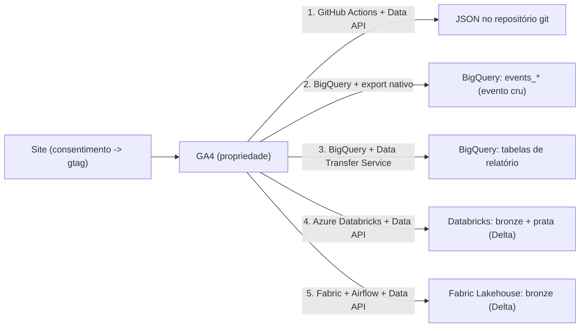

# GA4: as 5 formas de extrair os dados

O Google Analytics 4 tem um ponto de coleta (a propriedade) e mais de uma forma
de tirar o dado de lá. Este case mostra cinco pipelines de extração, cada um
numa stack diferente: como é montado, o que entrega e quanto custa.

O eixo que separa os cinco é **como o dado chega**:

- **Via GA4 Data API** (caminhos 1, 4, 5) — você escreve um `runReport` pedindo
  as métricas e dimensões. Muda o runtime: GitHub Actions, ou **Microsoft
  Azure** (Azure Databricks, Microsoft Fabric + Airflow).
- **Via BigQuery** (caminhos 2, 3), no **Google Cloud** — o Google entrega, você
  só configura no console. Muda o que vem: evento cru (export nativo) ou tabela
  de relatório pronta (Data Transfer Service).

Não competem. Um projeto real liga vários ao mesmo tempo — um número solto pra
um dashboard leve, o evento cru pra modelar do zero, o pipeline em camadas pra
BI.

Glossário das ferramentas e conceitos (REST, cluster, medallion, Delta Lake,
Unity Catalog, service principal, etc.): [`CONCEITOS.md`](CONCEITOS.md).

## Visão geral

### Via GA4 Data API — caminhos 1, 4, 5

Mesma API (`runReport`), autenticada por service account. Muda o runtime. Os
caminhos 4 e 5 rodam na **Microsoft Azure** (Azure Databricks, Microsoft
Fabric); o 1 não tem nuvem de dados, roda no CI do GitHub.

| | 1 · GitHub Actions | 4 · Azure Databricks | 5 · Fabric + Airflow |
|---|---|---|---|
| Nuvem | GitHub (sem warehouse) | Microsoft Azure | Microsoft Azure |
| Runtime | GitHub Actions (CI) | cluster Spark do Databricks | cluster Spark do Fabric |
| Linguagem | Node.js, sem dependências | PySpark | PySpark |
| Orquestrador | cron do Actions | scheduler do Databricks | Apache Airflow (Docker) via API REST |
| Saída | JSON no repositório | Delta: bronze **+ prata** (Unity Catalog) | Delta: bronze (Lakehouse / OneLake) |
| Segredo | GitHub secret | Databricks secret scope | Azure Key Vault + service principal |
| Custo | grátis, dentro da cota da API | compute do Databricks | capacidade do Fabric |
| Pasta | `caminho-1-github-actions-data-api/` | `caminho-4-azure-databricks-data-api/` | `caminho-5-microsoft-fabric-airflow-data-api/` |

### Via BigQuery — caminhos 2, 3

Tudo no **Google Cloud**: o Google escreve direto no seu BigQuery, sem código,
só configuração de console.

| | 2 · export nativo | 3 · Data Transfer Service |
|---|---|---|
| Nuvem | Google Cloud | Google Cloud |
| Onde configura | Admin do GA4 -> Vinculações do BigQuery | BigQuery -> Transferências -> conector "Google Analytics 4" |
| O que sai | evento cru, um registro por evento | tabelas de relatório já agregadas |
| Frequência | streaming + tabela diária | a cada 24h, com janela de reprocessamento |
| Autenticação | conta Google com acesso à propriedade (1 clique) | conta Google (OAuth, 1 vez) |
| Custo | armazenamento no BigQuery | armazenamento no BigQuery |
| Pasta | `caminho-2-google-bigquery-export-nativo/` (config + SQL) | `caminho-3-google-bigquery-data-transfer-service/` (config + SQL) |

---

## Caminho 1 — GitHub Actions + GA4 Data API

A API oficial de leitura do GA4 (`analyticsdata.googleapis.com`). Você faz um
`runReport` pedindo métricas e dimensões e recebe JSON. Um job agendado roda de
tempos em tempos, salva o JSON, e a página (ou o Slack, ou o que for) lê esse
arquivo. Sem banco de dados no meio.

### Como montar

1. No Google Cloud, criar uma **service account** e ativar a **Google Analytics
   Data API** no projeto.
2. No Admin do GA4, em **Administração -> Acesso à propriedade**, adicionar o
   e-mail da service account como **Leitor**.
3. Gerar uma **chave JSON** da service account. Guardar como secret
   (`GA_SA_KEY`). Nunca commitar.
4. Rodar o script passando a chave por variável de ambiente. Ele assina um JWT
   com a chave, troca por um access token e chama o `runReport`.
5. Agendar (aqui, um workflow do GitHub Actions a cada 3h).

### O que sai

Exatamente as métricas e dimensões do seu `runReport`. No exemplo deste repo:
totais dos últimos 28 dias (usuários, sessões, visualizações, engajamento
médio), série diária de visualizações e usuários, top páginas e top países.
Formato em [`caminho-1-github-actions-data-api/analytics.sample.json`](caminho-1-github-actions-data-api/analytics.sample.json).

### Detalhe: janela de reprocessamento

A série diária é histórico acumulado no próprio JSON. A cada execução o script
busca só os últimos 7 dias e sobrescreve esses dias no arquivo, preservando o
resto. O GA4 ainda corrige o dado recente por alguns dias; refazer uma janela
curta pega essa correção sem reprocessar tudo. Os totais e rankings são uma
janela móvel de 28 dias, sempre refeitos por inteiro (não têm histórico por dia).

### Serve para

Alimentar um dashboard leve, um site estático, um relatório recorrente. Quando
você quer poucos números, atualizados sozinhos, sem manter warehouse.

Código: [`caminho-1-github-actions-data-api/`](caminho-1-github-actions-data-api/)

---

## Caminho 2 — Google BigQuery + export nativo GA4

O link nativo. O Google escreve o **evento cru** direto num dataset seu no
BigQuery, sem você programar nada. É a base para qualquer modelagem séria
(sessão, atribuição, funil), porque vem no grão mais fino possível.

### Como montar

1. Ter um projeto no Google Cloud com faturamento e a API do BigQuery ativa.
2. No Admin do GA4: **Administração -> Vinculações de produtos -> Vinculações do
   BigQuery -> Vincular**.
3. Escolher o projeto, a região do dataset e o tipo de exportação: **streaming**
   (segundos de atraso), **diária** (tabela fecha depois que o dia termina no
   fuso da propriedade), ou as duas.
4. Pronto. Em algumas horas aparece o dataset `analytics_<ID_DA_PROPRIEDADE>`
   com `events_YYYYMMDD` (dia fechado) e `events_intraday_YYYYMMDD` (dia
   corrente).

### O que sai

Um registro por evento, no schema padrão do GA4, em inglês:
`event_name`, `event_params` (array aninhado de chave/valor), `user_pseudo_id`,
`event_timestamp`, mais os blocos `device`, `geo`, `traffic_source`,
`collected_traffic_source`, `session_traffic_source_last_click`, `ecommerce`.

Pegar um parâmetro exige `UNNEST(event_params)`. Exemplo de leitura (só ler o
cru, sem modelar) em
[`caminho-2-google-bigquery-export-nativo/exemplo.sql`](caminho-2-google-bigquery-export-nativo/exemplo.sql).

### Custo

Armazenamento no BigQuery. O streaming tem um custo pequeno de inserção; a
exportação diária é grátis.

### Serve para

Quando você quer o dado no grão do evento para modelar do seu jeito. Nada do
Google vem "pronto" aqui: é matéria-prima. É de onde sai a tabela
`dados_tratados` (16 dimensões, 21 métricas) que os caminhos 4 e 5 tentam
reproduzir pela Data API.

Detalhes: [`caminho-2-google-bigquery-export-nativo/`](caminho-2-google-bigquery-export-nativo/)

---

## Caminho 3 — Google BigQuery + Data Transfer Service

O BigQuery tem um conector **"Google Analytics 4"** no Data Transfer Service que
puxa as **tabelas de relatório prontas** do GA4, as mesmas da biblioteca de
relatórios: Aquisição de tráfego, Páginas e telas, Eventos, Dados demográficos,
Tecnologia, e outras.

### Como montar

1. **BigQuery -> Transferências de dados -> Criar transferência**.
2. Origem: **"Google Analytics 4"**.
3. Informar o **ID da propriedade**, o **dataset de destino**, a **frequência**
   (24h) e a **janela de atualização**: quantos dias reprocessar a cada
   execução, para pegar dado que o GA4 ainda estava fechando. 7 é um bom padrão.
4. Autorizar com sua **conta Google** (OAuth, uma vez). A conta precisa ter
   acesso à propriedade GA4.
5. O serviço agenda sozinho um preenchimento (backfill) dos últimos dias.

### O que sai

Uma tabela por relatório, particionada por data, no schema do Google. Cada
relatório vem em **dupla**:

- `p_ga4_<Relatorio>_<ID>`: tabela particionada com **todas** as cargas. Como a
  janela de 7 dias re-busca os mesmos dias, aqui há linhas repetidas.
- `ga4_<Relatorio>_<ID>`: **view** deduplicada por cima. É a que você consulta.

Exemplos: `ga4_TrafficAcquisition_<ID>`, `ga4_PagesAndScreens_<ID>`,
`ga4_Events_<ID>`. Consulta de exemplo em
[`caminho-3-google-bigquery-data-transfer-service/exemplo.sql`](caminho-3-google-bigquery-data-transfer-service/exemplo.sql).

### Custo

Fontes do próprio Google no Data Transfer Service não têm taxa de transferência. Só o
armazenamento das tabelas.

### Serve para

Ter rápido, sem escrever SQL de modelagem, os números que o GA4 já mostra na
tela, num lugar onde dá para juntar com outras fontes. Não te dá o evento cru.

Detalhes: [`caminho-3-google-bigquery-data-transfer-service/`](caminho-3-google-bigquery-data-transfer-service/)

---

## Caminho 4 — Azure Databricks + GA4 Data API

O caminho 1 virado pipeline de engenharia. A mesma GA4 Data API, agora em
**PySpark no Azure Databricks**, gravando **Delta Lake** governado pelo **Unity
Catalog**. Duas camadas: bronze (9 chamadas, uma tabela por tema, todas
ancoradas na mesma chave de atribuição) e **prata** (uma tabela larga tratada,
equivalente ao `dados_tratados` do BigQuery — agrega cada bronze pra chave de 5,
pivota os eventos em coluna e cruza tudo, com checagem de que a soma bate).

Stack: GA4 Data API · Databricks · PySpark · Delta Lake · Unity Catalog · secret
scope · Serverless SQL Warehouse.

Detalhes e código: [`caminho-4-azure-databricks-data-api/`](caminho-4-azure-databricks-data-api/)

---

## Caminho 5 — Microsoft Fabric + Airflow + GA4 Data API

O mesmo caminho, outra stack, com o foco na **orquestração**. A extração roda num
**Notebook do Microsoft Fabric** (Spark), gravando Delta num **Lakehouse**. O
**Apache Airflow** roda local (Docker) e não toca no dado: dispara o Notebook
pela **API REST do Fabric** autenticado por **service principal** do Entra ID, e
acompanha o status. A extração em si (Data API num notebook) já é padrão; o que
raramente aparece pronto é Airflow externo acionando o Fabric por service
principal.

Bronze só (9 chamadas), sem prata ainda. Cobre as 16 dimensões e quase todas as
métricas da tratada do BigQuery — ficam de fora `paginas_distintas` e
`sessoes_novas`, que só saem do evento cru (caminho 2).

Stack: Apache Airflow · Docker · Microsoft Fabric · Lakehouse / OneLake · Delta
Lake · GA4 Data API · Entra ID service principal · Azure Key Vault · REST.

Detalhes e código: [`caminho-5-microsoft-fabric-airflow-data-api/`](caminho-5-microsoft-fabric-airflow-data-api/)

---

## O que vem depois

A camada tratada (nomes em português, agregação por sessão e por campanha,
eventos como coluna) já existe no **caminho 4** (`google_analytics_tratado`) e é
o próximo passo natural do **caminho 5**. Depois disso vem o consumo: modelo
semântico, dashboards, recortes de negócio.
