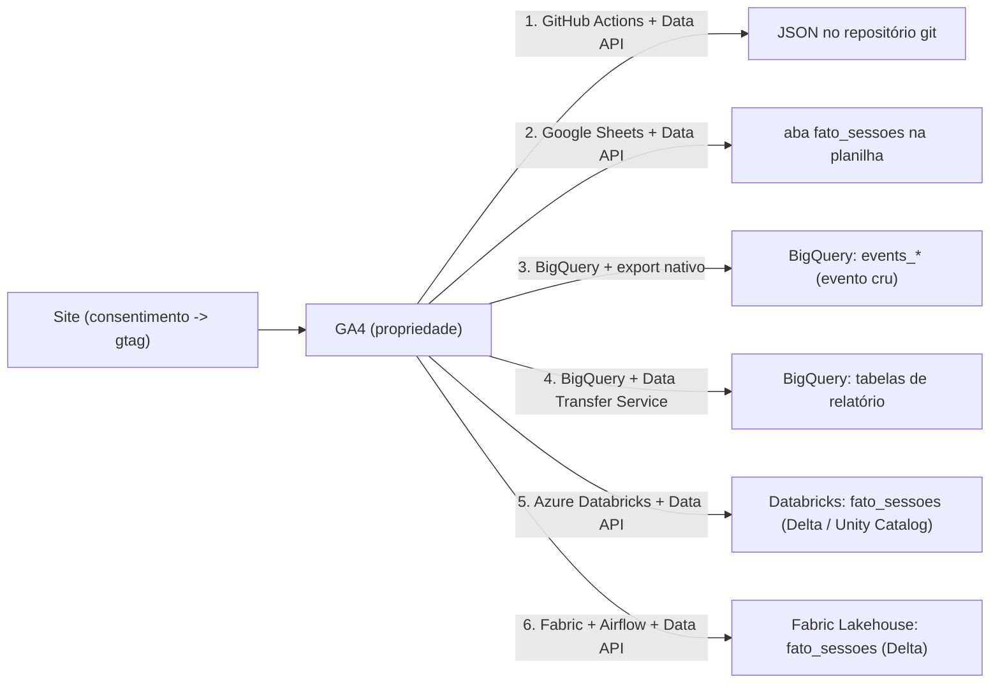

# GA4: as 6 formas de extrair os dados

O Google Analytics 4 tem um ponto de coleta (a propriedade) e mais de uma forma
de tirar o dado de lá. Este case mostra seis pipelines de extração, cada um numa
stack diferente: como é montado, o que entrega e quanto custa. A ordem vai do
mais leve (um arquivo no git) ao mais pesado (Spark com orquestrador externo).

O eixo que separa os seis é **como o dado chega**:

- **Via GA4 Data API** (caminhos 1, 2, 5, 6) — você (ou o add-on) escreve um
  `runReport` pedindo métricas e dimensões. Muda o runtime: GitHub Actions,
  Google Sheets, ou **Microsoft** — Azure Databricks (no Azure) ou Microsoft
  Fabric + Airflow (Fabric é plataforma SaaS própria, não é Azure).
- **Via BigQuery** (caminhos 3, 4), no **Google Cloud** — o Google entrega, você
  só configura no console. Muda o que vem: evento cru (export nativo) ou tabela
  de relatório pronta (Data Transfer Service).

Não competem. Um projeto real liga vários ao mesmo tempo — um número solto pra
um dashboard leve, o evento cru pra modelar do zero, o pipeline governado pra BI.

## A tabela de mídia — `fato_sessoes`

Quatro caminhos entregam **a mesma tabela**: uma linha por combinação das **9
dimensões mais importantes pra mídia**, com **10 métricas**. É o teto de uma
chamada `runReport`.

| Dimensões (9) | Métricas (10) |
|---|---|
| `date` | `sessions` |
| `sessionDefaultChannelGroup` (canal) | `totalUsers` |
| `sessionSource` (origem) | `newUsers` |
| `sessionMedium` (mídia) | `engagedSessions` |
| `sessionManualAdContent` (utm_content) | `engagementRate` |
| `sessionCampaignId` (utm_id) | `screenPageViews` |
| `operatingSystem` (SO) | `eventsPerSession` |
| `city` (cidade) | `keyEvents` |
| `landingPagePlusQueryString` (página de entrada) | `sessionKeyEventRate` |
| | `averageSessionDuration` |

Os caminhos **2, 5 e 6** pegam essa tabela pronta da Data API, numa única
chamada `runReport`. O **caminho 3** constrói o mesmo por SQL a partir do evento
cru, sem teto de dimensão. O **caminho 1** é um snapshot JSON leve (poucos
números). O **caminho 4** não entrega essa tabela: cada relatório é de um tema
só, e cruzar dois pela data atribui a métrica de um recorte a outro que nunca
foi a mesma sessão. Enviesa.

## Visão geral

### Via GA4 Data API — caminhos 1, 2, 5, 6

Mesma API (`runReport`). Muda o runtime e o que se faz com a resposta.

| | 1 · GitHub Actions | 2 · Google Sheets | 5 · Azure Databricks | 6 · Fabric + Airflow |
|---|---|---|---|---|
| Runtime | GitHub Actions (CI) | add-on GA4 Reports Builder | cluster Spark do Databricks | cluster Spark do Fabric |
| Código | Node.js, sem dependências | nenhum (config no Sheets) | PySpark | PySpark |
| Orquestrador | cron do Actions | Schedule reports (Google) | scheduler do Databricks | Apache Airflow (Docker) via API REST |
| Saída | JSON no repositório | aba `fato_sessoes` | `fato_sessoes` em Delta (Unity Catalog) | `fato_sessoes` em Delta (Lakehouse) |
| Segredo | GitHub secret | conta Google (OAuth) | Databricks secret scope | Azure Key Vault + service principal |
| Custo | grátis | grátis | compute do Databricks | capacidade do Fabric |
| Pasta | `caminho-1-github-actions-data-api/` | `caminho-2-google-sheets-ga4-reports-builder/` | `caminho-5-microsoft-azure-databricks-data-api/` | `caminho-6-microsoft-fabric-airflow-data-api/` |

### Via BigQuery — caminhos 3, 4

Tudo no **Google Cloud**: o Google escreve direto no seu BigQuery, sem código,
só configuração de console.

| | 3 · export nativo | 4 · Data Transfer Service |
|---|---|---|
| Onde configura | Admin do GA4 -> Vinculações do BigQuery | BigQuery -> Transferências -> conector "Google Analytics 4" |
| O que sai | evento cru, um registro por evento | tabelas de relatório já agregadas, uma por tema |
| Frequência | streaming + tabela diária | a cada 24h, com janela de reprocessamento |
| Autenticação | conta Google com acesso à propriedade (1 clique) | conta Google (OAuth, 1 vez) |
| Custo | armazenamento no BigQuery (+ inserção, só no streaming) | armazenamento no BigQuery |
| `fato_sessoes`? | sim, por SQL de sessionização (sem teto de dims) | não: relatórios de tema único, cruzar dois enviesa |
| Pasta | `caminho-3-google-bigquery-export-nativo/` | `caminho-4-google-bigquery-data-transfer-service/` |

---

## Caminho 1 — GitHub Actions + GA4 Data API

A API oficial de leitura do GA4 (`analyticsdata.googleapis.com`). Você faz um
`runReport` pedindo métricas e dimensões e recebe JSON. Um job agendado roda de
tempos em tempos, salva o JSON, e a página (ou o Slack, ou o que for) lê esse
arquivo. Sem banco de dados no meio.

### Como montar

1. No Google Cloud, criar uma **service account** e ativar a **Google Analytics
   Data API** no projeto.
2. No Admin do GA4, em **Administração -> Acesso à propriedade**, adicionar o
   e-mail da service account como **Leitor**.
3. Gerar uma **chave JSON** da service account. Guardar como secret
   (`GA_SA_KEY`). Nunca commitar.
4. Rodar o script passando a chave por variável de ambiente. Ele assina um JWT
   com a chave, troca por um access token e chama o `runReport`.
5. Agendar (aqui, um workflow do GitHub Actions a cada 3h).

### O que sai

Um snapshot leve: totais dos últimos 28 dias (usuários, sessões, visualizações,
engajamento médio), série diária de visualizações e usuários, top páginas e top
países. Formato em
[`caminho-1-github-actions-data-api/analytics.sample.json`](caminho-1-github-actions-data-api/analytics.sample.json).

### Detalhe: janela de reprocessamento

A série diária é histórico acumulado no próprio JSON. A cada execução o script
refaz a janela de **hoje + os 7 dias anteriores** (8 datas) e sobrescreve esses
dias no arquivo, preservando o resto. A de hoje entra parcial e é reescrita a
cada run; o GA4 ainda corrige o dado recente por alguns dias, então refazer uma
janela curta pega essa correção sem reprocessar tudo. Os totais e rankings são
uma janela móvel de 28 dias, sempre refeitos por inteiro (não têm histórico por
dia).

### Serve para

Alimentar um dashboard leve, um site estático, um relatório recorrente. Quando
você quer poucos números, atualizados sozinhos, sem manter warehouse.

Código: [`caminho-1-github-actions-data-api/`](caminho-1-github-actions-data-api/)

---

## Caminho 2 — Google Sheets + GA4 Reports Builder

O add-on oficial **"GA4 Reports Builder for Google Analytics"** roda a Data API
por baixo — o "pipeline" é a planilha, o agendador é do Google. Zero infra, zero
código, zero service account: autoriza com a sua conta Google (papel Leitor na
propriedade).

Uma aba de **Report Configuration** define o relatório; **Run reports** escreve a
aba `fato_sessoes`. **Schedule reports** roda diário no lado do Google, mesmo com
a planilha fechada.

O que sai é o `fato_sessoes` — o mesmo schema dos caminhos 5 e 6.

Detalhes e config: [`caminho-2-google-sheets-ga4-reports-builder/`](caminho-2-google-sheets-ga4-reports-builder/)

---

## Caminho 3 — Export nativo GA4 → BigQuery

O link nativo. O Google escreve o **evento cru** direto num dataset seu no
BigQuery, sem você programar nada. É a base para qualquer modelagem séria
(sessão, atribuição, funil), porque vem no grão mais fino possível.

### Como montar

1. Ter um projeto no Google Cloud com faturamento e a API do BigQuery ativa.
2. No Admin do GA4: **Administração -> Vinculações de produtos -> Vinculações do
   BigQuery -> Vincular**.
3. Escolher o projeto, a região do dataset e o tipo de exportação: **streaming**
   (segundos de atraso), **diária** (tabela fecha depois que o dia termina no
   fuso da propriedade), ou as duas.
4. Pronto. Em algumas horas aparece o dataset `analytics_<ID_DA_PROPRIEDADE>`
   com `events_YYYYMMDD` (dia fechado) e `events_intraday_YYYYMMDD` (dia
   corrente).

### O que sai

Um registro por evento, no schema padrão do GA4: `event_name`, `event_params`
(array aninhado de chave/valor), `user_pseudo_id`, `event_timestamp`, mais os
blocos `device`, `geo`, `traffic_source`, `collected_traffic_source`,
`session_traffic_source_last_click`, `ecommerce`.

Do evento cru você monta o `fato_sessoes` por SQL — sessioniza por
`ga_session_id`, pega o last-click, herda device/geo, deriva landing/exit page —
e aqui **não há teto de 9 dimensões**: a
[`fato_sessoes.sql`](caminho-3-google-bigquery-export-nativo/fato_sessoes.sql)
cria uma view `dados_tratados.fato_sessoes` com ~50 dimensões e ~50 métricas
(atribuição completa, Google Ads, primeiro toque, funil e-commerce). É a base
com mais informação numa tabela só entre os 6 caminhos.

### Custo

Armazenamento no BigQuery. O streaming tem um custo pequeno de inserção; a
exportação diária é grátis.

### Serve para

Quando você quer o dado no grão do evento para modelar do seu jeito, ou uma
tabela de mídia com mais de 9 dimensões. Nada do Google vem "pronto" aqui: é
matéria-prima.

Detalhes: [`caminho-3-google-bigquery-export-nativo/`](caminho-3-google-bigquery-export-nativo/)

---

## Caminho 4 — Google BigQuery + Data Transfer Service

O BigQuery tem um conector **"Google Analytics 4"** no Data Transfer Service que
puxa as **tabelas de relatório prontas** do GA4, as mesmas da biblioteca de
relatórios: Aquisição de tráfego, Páginas e telas, Eventos, Dados demográficos,
Tecnologia, e outras.

### Como montar

1. **BigQuery -> Transferências de dados -> Criar transferência**.
2. Origem: **"Google Analytics 4"**.
3. Informar o **ID da propriedade**, o **dataset de destino**, a **frequência**
   (24h) e a **janela de atualização**: quantos dias reprocessar a cada
   execução, para pegar dado que o GA4 ainda estava fechando. 7 é um bom padrão.
4. Autorizar com sua **conta Google** (OAuth, uma vez). A conta precisa ter
   acesso à propriedade GA4.
5. O serviço agenda sozinho um preenchimento (backfill) dos últimos dias.

### O que sai

Uma tabela por relatório, particionada por data, no schema do Google. Cada
relatório vem em **dupla**:

- `p_ga4_<Relatorio>_<ID>`: tabela particionada com **todas** as cargas. Como a
  janela de 7 dias re-busca os mesmos dias, aqui há linhas repetidas.
- `ga4_<Relatorio>_<ID>`: **view** deduplicada por cima. É a que você consulta.

Cada relatório é um agregado de **um tema só** (aquisição, ou device, ou landing,
ou geo). Não dá pra montar o `fato_sessoes` aqui, e não é só falta de chave:
juntar dois relatórios pela data pega a métrica de um recorte e repete pra cada
valor do outro, como se `Organic` + `iOS` fosse uma sessão que o GA4 mediu. É
contar o número de um usuário no balde de outro. Cada consulta lê **um**
relatório. Exemplo em
[`caminho-4-google-bigquery-data-transfer-service/exemplo.sql`](caminho-4-google-bigquery-data-transfer-service/exemplo.sql).

### Custo

Fontes do próprio Google no Data Transfer Service não têm taxa de transferência.
Só o armazenamento das tabelas.

### Serve para

Ter rápido, sem escrever SQL de modelagem, os números que o GA4 já mostra na
tela, num lugar onde dá para ligar com outras fontes por uma chave real (data,
campanha) num modelo de BI. Não te dá o evento cru, e os relatórios não se
cruzam entre si sem enviesar.

Detalhes: [`caminho-4-google-bigquery-data-transfer-service/`](caminho-4-google-bigquery-data-transfer-service/)

---

## Caminho 5 — Microsoft Azure Databricks + GA4 Data API

O caminho 1 virado pipeline governado. A mesma GA4 Data API, agora em **PySpark
no Azure Databricks**, gravando **uma tabela Delta** no **Unity Catalog**:
`raulpavao.ga4.fato_sessoes`. Uma chamada `runReport` (9 dims de mídia, 10
métricas), full-refresh a cada execução.

Stack: GA4 Data API · Databricks · PySpark · Delta Lake · Unity Catalog · secret
scope · Serverless SQL Warehouse.

Detalhes e código: [`caminho-5-microsoft-azure-databricks-data-api/`](caminho-5-microsoft-azure-databricks-data-api/)

---

## Caminho 6 — Microsoft Fabric + Airflow + GA4 Data API

O mesmo caminho, outra stack, com o foco na **orquestração**. A extração roda num
**Notebook do Microsoft Fabric** (Spark), gravando o mesmo `fato_sessoes` em
Delta num **Lakehouse**. O **Apache Airflow** roda local (Docker) e não toca no
dado: dispara o Notebook pela **API REST do Fabric** autenticado por **service
principal** do Entra ID, e acompanha o status. A extração em si já é padrão; o
que raramente aparece pronto é Airflow externo acionando o Fabric por service
principal.

Stack: Apache Airflow · Docker · Microsoft Fabric · Lakehouse / OneLake · Delta
Lake · GA4 Data API · Entra ID service principal · Azure Key Vault · REST.

Detalhes e código: [`caminho-6-microsoft-fabric-airflow-data-api/`](caminho-6-microsoft-fabric-airflow-data-api/)

---

## O que vem depois

Todo caminho para na extração. O que vem depois — modelagem em camadas, tabela
tratada por sessão e por campanha, modelo semântico, dashboards, recortes de
negócio — é o mesmo trabalho seja qual for a fonte, e fica fora do escopo deste
case. O `fato_sessoes` já é o suficiente pra ligar num Looker Studio ou Power BI.
