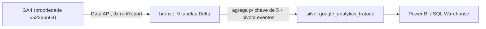

# Caminho 4 — Azure Databricks + GA4 Data API

Extração do GA4 do site raulpavao.com.br (propriedade `552236564`) direto pela
**GA4 Data API** — sem passar pelo BigQuery — rodando em **PySpark no Azure
Databricks**, gravando **Delta Lake** governado pelo **Unity Catalog**. Duas
camadas: bronze (9 chamadas, uma tabela por tema) e prata (uma tabela larga
tratada, equivalente ao `dados_tratados` do BigQuery).

É o [caminho 1](../caminho-1-github-actions-data-api/) (Data API) num pipeline de
engenharia de dados de verdade: catálogo, camadas, PySpark, checagem de
qualidade.

## Stack

| Camada | Ferramenta | Papel |
|---|---|---|
| Extração | GA4 Data API (`google-analytics-data`) | `runReport`, autenticado por service account |
| Segredo | Databricks secret scope | chave da service account em `ga4/service-account-key` |
| Compute | cluster Spark do Databricks | roda os notebooks |
| Transformação | PySpark | `createDataFrame`, `groupBy/agg`, `pivot`, `join` |
| Formato | Delta Lake | tabelas com schema evolutivo (`overwriteSchema`) |
| Governança | Unity Catalog | `raulpavao.bronze.*`, `raulpavao.silver.*` |
| Consulta | Serverless SQL Warehouse | validação ad-hoc da prata |

Conceitos (medallion, chave de atribuição, cluster driver/executor, pivô de
evento, grão) explicados em [`../CONCEITOS.md`](../CONCEITOS.md).

## Arquitetura



## Bronze — 9 chamadas, chave comum

A Data API aceita no máximo **9 dimensões e 10 métricas por consulta**. Toda
tabela carrega a mesma **chave de atribuição** nas 5 primeiras posições
(`date, sessionDefaultChannelGroup, sessionSource, sessionMedium, sessionCampaignName`)
e usa o resto do orçamento pra cobrir um tema. Mesmo padrão que o pacote dbt
oficial da Fivetran usa pra modelar GA4.

| Tabela | Dimensões extras | Métricas |
|---|---|---|
| `ga4_sessions_daily` | `sessionCampaignId`, `sessionPrimaryChannelGroup` | sessions, totalUsers, newUsers, engagedSessions, screenPageViews |
| `ga4_first_touch_daily` | `firstUserDefaultChannelGroup`, `firstUserSource`, `firstUserMedium` | sessions, totalUsers |
| `ga4_key_events_daily` | — | keyEvents, sessions |
| `ga4_device_daily` | `deviceCategory`, `operatingSystem`, `browser` | sessions, activeUsers, engagedSessions, screenPageViews |
| `ga4_geo_daily` | `country`, `region`, `city` | sessions, activeUsers, engagedSessions, screenPageViews |
| `ga4_landing_page_daily` | `landingPage` | sessions, activeUsers, engagedSessions, screenPageViews |
| `ga4_events_daily` | `eventName`, `deviceCategory`, `country` | eventCount, activeUsers |
| `ga4_ecommerce_daily` | — | transactions, purchaseRevenue, ecommercePurchases |
| `ga4_pages_daily` | `pagePath` | screenPageViews, activeUsers |

Tabela sem tráfego no período (e-commerce num site sem loja) grava vazia com o
schema certo, não quebra.

## Prata — `google_analytics_tratado`

Uma linha por `(data, canal, origem, mídia, campanha)`, com tudo junto:

1. **Agrega antes de juntar.** Cada bronze é somado até a chave de 5 antes de
   qualquer `join`. Nunca junta sem agregar — senão as dimensões extras de cada
   bronze duplicam ou perdem linha.
2. **Pivota eventos.** `ga4_events_daily` traz `eventName` como linha; vira uma
   coluna por evento (`visualizacoes_pagina`, `rolagens`, `cliques_saida`,
   `downloads`, `formularios_enviados`, `compras`, `leads_fechados`…). Evento
   fora da lista de labels mantém o nome original — nunca fica de fora do pivô.
3. **Confere.** No fim compara `SUM(total_eventos)` com a soma de todas as
   colunas de evento. Bateu (355 = 355) na última carga.

## Rodar

Os dois notebooks estão em `/Workspace/Users/<você>/portfolio-ga4/` no
Databricks. `ga4_bronze_ingest` grava as 9 bronze; `ga4_silver_tratado` monta a
prata e sai com um `dbutils.notebook.exit` em JSON (linhas, exemplo,
conferência).

Pré-requisitos:

1. Projeto no Google Cloud com a **GA4 Data API** ativa e uma **service
   account** com a chave JSON.
2. No Admin do GA4 → **Acesso à propriedade**, a service account como **Leitor**.
3. Secret scope no Databricks:
   ```bash
   databricks secrets create-scope ga4
   databricks secrets put-secret ga4 service-account-key --json "@chave.json"
   ```
4. Unity Catalog com os schemas `raulpavao.bronze` e `raulpavao.silver`.

## Arquivos

| Arquivo | O que é |
|---|---|
| `ga4_bronze_ingest.py` | notebook das 9 chamadas (export SOURCE do Databricks) |
| `ga4_silver_tratado.py` | notebook da prata: agrega, pivota, junta, confere |

## Diferença pro caminho 5 (Fabric + Airflow)

Mesma família (GA4 Data API → lakehouse Delta). Aqui: as 9 bronze **e** a prata
cruzada, no ecossistema nativo do Databricks (Unity Catalog, secret scope).
[Lá](../caminho-5-microsoft-fabric-airflow-data-api/): as 9 bronze, ainda sem prata, mas com
**Airflow externo** orquestrando o Fabric por service principal. Um mostra
modelagem em camadas completa; o outro, o orquestrador que qualquer empresa fora
do Databricks reconhece.
