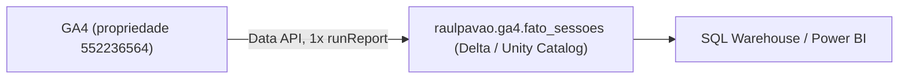

# Caminho 5 — Microsoft Azure Databricks + GA4 Data API

Extração do GA4 do site raulpavao.com.br (propriedade `552236564`) direto pela
**GA4 Data API** — sem passar pelo BigQuery — rodando em **PySpark no Azure
Databricks**, gravando **uma tabela Delta** governada pelo **Unity Catalog**:
`raulpavao.ga4.fato_sessoes`.

É o [caminho 1](../caminho-1-github-actions-data-api/) (Data API) num ambiente de
engenharia de dados de verdade: catálogo, governança, Delta, cluster Spark.

## Stack

| Item | Ferramenta | Papel |
|---|---|---|
| Extração | GA4 Data API (`google-analytics-data`) | `runReport`, autenticado por service account |
| Segredo | Databricks secret scope | chave da service account em `ga4/service-account-key` |
| Compute | cluster Spark do Databricks | roda o notebook |
| Escrita | PySpark | `createDataFrame`, `write...saveAsTable` (Delta) |
| Formato | Delta Lake | `overwriteSchema` no full-refresh |
| Governança | Unity Catalog | `raulpavao.ga4.fato_sessoes` |
| Consulta | Serverless SQL Warehouse | validação ad-hoc / ligação com Power BI |

Conceitos (chave de atribuição, cluster driver/executor, grão, tabela de mídia)
em [`../CONCEITOS.md`](../CONCEITOS.md).

## Arquitetura



## O que o Notebook faz

**Uma** chamada `runReport`: 9 dimensões de mídia, 10 métricas — o teto de uma
chamada da Data API. Grava `raulpavao.ga4.fato_sessoes` em Delta. É o **mesmo
schema** do caminho 2 (Sheets) e do caminho 6 (Fabric).

| Dimensões (9) | Métricas (10) |
|---|---|
| `date` | `sessions` |
| `sessionDefaultChannelGroup` | `totalUsers` |
| `sessionSource` | `newUsers` |
| `sessionMedium` | `engagedSessions` |
| `sessionManualAdContent` (utm_content) | `engagementRate` |
| `sessionCampaignId` (utm_id) | `screenPageViews` |
| `operatingSystem` | `eventsPerSession` |
| `city` | `keyEvents` |
| `landingPagePlusQueryString` | `sessionKeyEventRate` |
| | `averageSessionDuration` |

Período sem tráfego grava tabela vazia com o schema certo, não quebra.

## Rodar

O notebook fica em `/Workspace/Users/<você>/portfolio-ga4/` no Databricks.
`ga4_fato_sessoes` grava a tabela e imprime a contagem de linhas.

Pré-requisitos:

1. Projeto no Google Cloud com a **GA4 Data API** ativa e uma **service
   account** com a chave JSON.
2. No Admin do GA4 → **Acesso à propriedade**, a service account como **Leitor**.
3. Secret scope no Databricks:
   ```bash
   databricks secrets create-scope ga4
   databricks secrets put-secret ga4 service-account-key --json "@chave.json"
   ```
4. Unity Catalog com o schema `raulpavao.ga4`.

## Arquivos

| Arquivo | O que é |
|---|---|
| `ga4_fato_sessoes.py` | notebook da chamada única (export SOURCE do Databricks) |

## Diferença pro caminho 6 (Fabric + Airflow)

Mesma família (GA4 Data API → tabela Delta) e **o mesmo `fato_sessoes`**. A
diferença é o ambiente e a orquestração: aqui, tudo no ecossistema nativo do
Databricks (Unity Catalog, secret scope, scheduler do Databricks).
[Lá](../caminho-6-microsoft-fabric-airflow-data-api/): a mesma tabela num
Lakehouse do Fabric, com **Airflow externo** disparando o notebook por service
principal. Um é o pipeline dentro da plataforma; o outro, o orquestrador que
qualquer empresa fora do Databricks reconhece.
