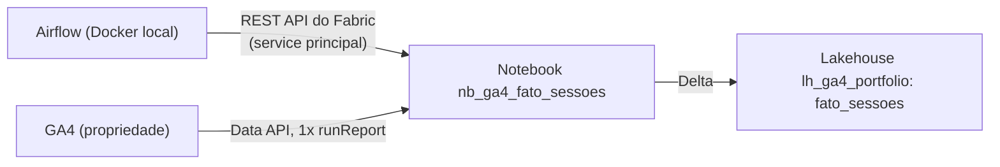

# Caminho 6 — Microsoft Fabric + Airflow + GA4 Data API

O [caminho 1](../caminho-1-github-actions-data-api/) (GA4 Data API) rodando
dentro de um Notebook do Microsoft Fabric que grava uma tabela Delta num
Lakehouse. O Airflow roda local (Docker), não toca no dado: só dispara o Notebook
pela API do Fabric e espera terminar.

O ponto do case é a **orquestração**. A extração em si (GA4 Data API dentro de um
notebook) já é padrão conhecido. O que raramente aparece pronto é Airflow fora
do Fabric acionando um item do Fabric por service principal.

## Stack

| Camada | Ferramenta | Papel |
|---|---|---|
| Orquestração | Apache Airflow 2.10.5 (Docker local, LocalExecutor + Postgres) | agenda, dispara, lê status |
| Provider | `apache-airflow-providers-microsoft-fabric` (`MSFabricRunJobOperator`) | embrulho do `POST` + `GET` na API do Fabric |
| Identidade | service principal do Entra ID + OAuth2 client credentials | Airflow se autentica sem usuário humano |
| Compute | cluster Spark efêmero do Fabric (sessão Livy) na capacidade de avaliação | roda o notebook |
| Bibliotecas | Environment do Fabric (`env-ga4`) | `google-analytics-data` pré-instalado |
| Extração | GA4 Data API (`google-analytics-data`) | `runReport`, autenticado por service account |
| Segredo | Azure Key Vault (`kv-raulpavao-fabric`) | chave da service account, lida por `notebookutils.credentials.getSecret` |
| Formato / catálogo | Delta Lake no Lakehouse (`lh_ga4_portfolio`, OneLake) | tabela `fato_sessoes` + SQL analytics endpoint |

Conceitos (REST, cluster driver/executor, capacidade/SKU, sessão Livy,
Environment, deferrable, tabela de mídia, chave de atribuição) em
[`../CONCEITOS.md`](../CONCEITOS.md).

## Arquitetura



| Peça | Onde roda | Papel |
|---|---|---|
| Airflow | Docker na sua máquina | agenda e dispara, lê status |
| Notebook `nb_ga4_fato_sessoes` | cluster Spark efêmero do Fabric | chama a GA4 Data API e grava Delta |
| Environment `env-ga4` | Fabric | traz `google-analytics-data` pré-instalado no cluster |
| Key Vault `kv-raulpavao-fabric` | Azure | guarda a chave da service account do GA4 |
| Lakehouse `lh_ga4_portfolio` | OneLake | a tabela `fato_sessoes` |

Ao disparar, o Fabric sobe um cluster (1 driver + executores) na capacidade,
roda o notebook e derruba o cluster no fim. O driver faz a chamada à API do
GA4; os executores distribuem a gravação Delta. A capacidade de avaliação é
pequena, cabe ~um cluster por vez.

## O que o Notebook faz

**Uma** chamada `runReport`: 9 dimensões de mídia, 10 métricas — o teto de uma
chamada da Data API. Grava a tabela Delta `fato_sessoes` no Lakehouse. É o
**mesmo schema** do caminho 2 (Sheets) e do caminho 5 (Databricks).

| Dimensões (9) | Métricas (10) |
|---|---|
| `date` | `sessions` |
| `sessionDefaultChannelGroup` | `totalUsers` |
| `sessionSource` | `newUsers` |
| `sessionMedium` | `engagedSessions` |
| `sessionManualAdContent` (utm_content) | `engagementRate` |
| `sessionCampaignId` (utm_id) | `screenPageViews` |
| `operatingSystem` | `eventsPerSession` |
| `city` | `keyEvents` |
| `landingPagePlusQueryString` | `sessionKeyEventRate` |
| | `averageSessionDuration` |

Cobrir mais que 9 dimensões numa tabela só não sai da Data API — aí seria
BigQuery com evento cru ([caminho 3](../caminho-3-google-bigquery-export-nativo/)).

A chave da service account vem do Key Vault por
`notebookutils.credentials.getSecret`, nunca fica no código.

### Bibliotecas: Environment, não `%pip`

`%pip install` é bloqueado em execução agendada do Fabric (só funciona
interativo). `!pip` instala mas quebra o import por conflito de dependências
(protobuf). O certo é um **Environment** (`env-ga4`) com `google-analytics-data`
pré-instalado, anexado ao notebook. O notebook não tem célula de install.

## REST, o mínimo pra entender o que o Airflow faz

Toda a orquestração é chamada HTTP na API REST do Fabric
(`https://api.fabric.microsoft.com/v1/...`). O `MSFabricRunJobOperator` não tem
mágica: é um `POST` pra disparar e um `GET` em loop pra acompanhar.

Verbos:

| Método | Uso | Exemplo no case |
|---|---|---|
| `GET` | ler | `GET /workspaces/{ws}/items/{id}/jobs/instances/{run}` |
| `POST` | criar ou disparar uma ação | `POST /workspaces/{ws}/items/{id}/jobs/instances?jobType=RunNotebook` |
| `PATCH` / `PUT` | atualizar | trocar a definição do notebook |
| `DELETE` | apagar | remover um item |

Status codes que aparecem:

| Faixa | Sentido | Comuns aqui |
|---|---|---|
| 2xx | deu certo | `200 OK`, `201 Created`, `202 Accepted` (assíncrono), `204 No Content` |
| 4xx | erro seu | `401` sem token, `403` token ok mas sem permissão, `404` não existe, `429` rate limit |
| 5xx | erro do servidor | `500`, `503` |

Padrão assíncrono (é o do disparo de notebook): o `POST` volta `202` com um
header `Location`. Você faz `GET` nesse `Location` de tempos em tempos até o
status virar `Completed` ou `Failed`. O Airflow faz esse polling sozinho; em
modo `deferrable` ele libera o worker entre as checagens.

Autenticação: header `Authorization: Bearer <token>`. O token vem do Entra ID
por OAuth2 client credentials (o `clientId` + `clientSecret` do service
principal). O Airflow monta esse token a cada execução.

## Pré-requisitos no Fabric e no Entra ID

1. **App registration** no Entra ID (service principal). Já criado:
   - client_id `ae650abe-f2fa-47bc-96ce-9711cfba0aa6`
   - tenant `f63ceebf-5c0f-4b0c-8837-3c3139c38d92`
   - gerar o client secret:
     ```bash
     az ad app credential reset --id ae650abe-f2fa-47bc-96ce-9711cfba0aa6 --display-name airflow-local --years 1
     ```
2. **Tenant setting do Fabric**: Admin portal -> Tenant settings ->
   "Service principals can use Fabric APIs" -> ativar (pode restringir a um grupo
   de segurança que contém o app). Precisa de papel Fabric Administrator no
   Entra ID pra abrir essa tela.
3. **Papel no workspace**: no workspace `portfolio-ga4`
   (`5794b251-2e37-4dcd-95a2-6e07f81f78ba`), adicionar o app `airflow-fabric-ga4`
   como **Member**. Só o papel no workspace já dá `Item.Execute.All` nos itens
   dele. Workspace pessoal ("Meu workspace") não serve: não aceita service
   principal.
4. **Key Vault**: a identidade que roda o Notebook precisa de `get`/`list` nos
   secrets do `kv-raulpavao-fabric` (política de acesso, não RBAC). Quando o SP
   dispara o job, o Notebook roda como o SP, então o `get`/`list` tem que estar
   no objectId do SP.

## Rodar local

```bash
cp .env.example .env
# editar .env: colar o client secret na AIRFLOW_CONN_FABRIC_CONN
docker compose up -d --build
```

Airflow em http://localhost:8080 (admin / admin). Despausar o DAG
`ga4_fato_sessoes_fabric` e disparar. O DAG roda uma task só, `run_fato_sessoes`,
em modo deferrable: agenda o Notebook, libera o worker e volta a checar o status.

Parar tudo:

```bash
docker compose down
```

## Arquivos

| Arquivo | O que é |
|---|---|
| `docker-compose.yml` | Airflow LocalExecutor + Postgres, 2 serviços + init |
| `Dockerfile` | imagem oficial do Airflow 2.10.5 + provider do Fabric |
| `requirements.txt` | `apache-airflow-providers-microsoft-fabric` |
| `dags/ga4_fato_sessoes_fabric.py` | o DAG, um `MSFabricRunJobOperator` |
| `notebook_nb_ga4_fato_sessoes.py` | cópia versionada do código que roda no Fabric (a chamada única) |
| `.env.example` | conexão do Fabric (como URI) e os IDs do workspace/notebook |

## Notas

- A conexão do Fabric entra como variável de ambiente
  `AIRFLOW_CONN_FABRIC_CONN`. No provider 0.1.1 o SPN lê `auth_type`, `tenantId`,
  `clientId` e `clientSecret` do extra, então tudo vai na query string da URI:
  `microsoft-fabric://?auth_type=spn&tenantId=...&clientId=...&clientSecret=...`.
  Nenhum secret fica em arquivo de conexão do Airflow.
- `job_type="RunNotebook"` usa o Job Scheduler do Fabric. O mesmo operador roda
  pipeline, Spark job definition e dbt job trocando o `job_type`.
- O Notebook usa o Lakehouse padrão que está anexado a ele. Para forçar outro,
  passar `job_params` com `MSFabricNotebookJobParameters().set_default_lakehouse(...)`.
- **Contenção de capacidade**: a avaliação (FTL4) cabe ~um cluster Spark por vez.
  Se tiver uma sessão interativa aberta no notebook quando o Airflow disparar, o
  job falha com `430 TooManyRequestsForCapacity`. Feche a sessão interativa (ou
  use uma capacidade maior) antes de agendar.
- Alternativa gerenciada (sem Airflow): conectores no-code (Supermetrics,
  Windsor.ai) escrevem GA4 direto no OneLake. Este case existe para mostrar a
  orquestração, não porque seja a única forma.
